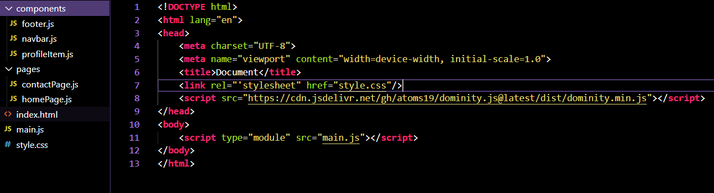

## the problem

i have to admit i hate meta frameworks ,well most of them they are a pain to setup and use and has 1000s of files and large codebases, but stuff like clientside routing and components attract me , i wanted to do all that with just some js files and folders without having to wait for node modules to install or go through a painful build process

## a simpler time

dominity is an attempt to go back to the old days where a server did all the heavy lifting and most of the client side interactivity used to be done by relatively small libraries like jquery
now that we have react a lot has changed

i want to put this out of my head first , dominity isnt react it will never be react , react is a superior to dominity in every way imaginable but still dominity wasnt intended for normal or sane peeps it was made for maniacs who likes the simplicity of projects that looks something like this

- there is no configs
- no node modules
- no js config , no ts config
- no babel
- you are free to add whatever you want ,no conventions everything is free thats Dominity

in the end of the day Dominity Provides similiar experience to jquery and React without a large and complicated codebase

dominity is `10KB` minified and even lesser if u use the lite version this hardly even impacts the load time

there are a few drawbacks i will address those as well

## dominity is your choice

dominity provides to ways to render or manipulate elements either you can get the components from the html file and apply reactivity besed methods similiar to what we did in jquery or we could make elements directly in js using certain functions

the choice is yours you could make it content first or not content first , you could make it progressively enhanced or not its all upto you

## what is the future

dominity will go through more refinement but it will not grow out of what it stands for , simplicity
i am thinking of adding more features that will refine the experience for dominity when used along with server and making it capable of integrating with tools like HTMX and web standards like Web-components and practices like server side rendering in the future
